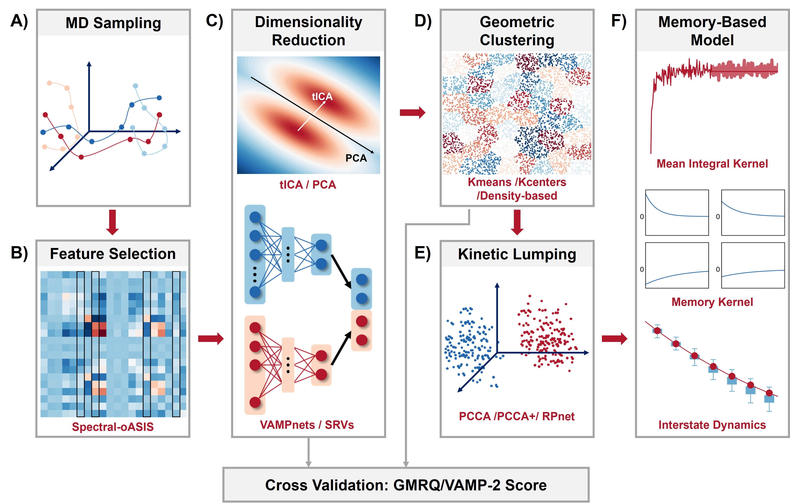

# GME_tutorials
  

Tutorials for non-Markovian dynamic models (qMSM and IGME) to study protein dynamics.

### Content
You'll find below step-by-step Jupyter notebooks that guide the construction of GME-based non-Markovian dynamic models (qMSM and IGME) in two peptide systems: the alanine dipeptide and villin headpiece.

**A. For the alanine dipeptide system:**

1. Featurization. [link to notebook](tutorials/alanine_dipeptide/Featurization.ipynb)
3. Cross-validation with GMRQ. [link to notebook](tutorials/alanine_dipeptide/Cross_Validation.ipynb)
4. Construction of Microstate-MSM. [link to notebook](tutorials/alanine_dipeptide/MicroMSM.ipynb) In this Jupyter notebook, Dimensionality Reduction, Geometric Clustering, and Microstate-MSM are included.
5. Construction of Macrostate-GME Model. [link to notebook](tutorials/alanine_dipeptide/MacroGME.ipynb) In this Jupyter notebook, Kinetic Lumping, Macrostate-qMSM, Macrostate-IGME, and Macrostate-MSM are included.

The colab notebook for the alanine dipeptide system is available: 
 

**B. For the villin headpiece system:**

We apply two independent methods for Dimensionality Reduction: tICA and SRVs. Either one is fine for this system. The Jupyter notebooks are as follows:

1. Featurization. [link to notebook](tutorials/villin_headpiece/Featurization.ipynb)
2. Feature Selection (by Spectral OASIS). [link to notebook](tutorials/villin_headpiece/Feature_Selection.ipynb)
3. Cross-validation with GMRQ.
   
   tICA version: [link to notebook](tutorials/villin_headpiece/tICA_Cross_Validation.ipynb)
   
   SRVs version: [link to notebook](tutorials/villin_headpiece/SRVs_Cross_Validation.ipynb)
4. Construction of Microstate-MSM.
   
   tICA version: [link to notebook](tutorials/villin_headpiece/tICA_MicroMSM.ipynb)
   
   SRVs version: [link to notebook](tutorials/villin_headpiece/SRVs_MicroMSM.ipynb) 
5. Construction of Macrostate-GME Model.
   
   Analysis after tICA: [link to notebook](tutorials/villin_headpiece/tICA_MicroMSM.ipynb)
   
   Analysis after SRVs: [link to notebook](tutorials/villin_headpiece/SRVs_MicroMSM.ipynb)

The colab notebook for the villin headpiece system is available: 
 
   

### Installation Guide:
We use [MSMBuilder2022](https://github.com/msmbuilder/msmbuilder2022) and [PyEMMA](https://github.com/markovmodel/PyEMMA/) 2.5.12 in our tutorial.

For MSMbuilder2022, you can use the Anaconda installation (This installation method is not applicable when the Python version is greater than 3.9):

	conda install -c conda-forge testmsm

You can also use install from PyPI (This installation method works for Python 3.10):

	pip install msmbuilder2022

For PyEMMA installation, you may refer to http://pyemma.org. And we recommend creating a new environment to install PyEMMA in case of any conflicts with MSMBuilder. The installation in a conda environment:

	conda install pyemma 

### Contact Information
You may contact Yue Wu wu678@wisc.edu/ Siqin Cao scao66@wisc.edu if you have any specific questions on the model construction or the original MD data of the alanine dipeptide.

You may contact D. E. Shaw Research for the MD data of the villine headpiece.

The featurized MD trajectories of the alanine dipeptide system can be downloaded [here](https://uwmadison.box.com/shared/static/xemwq0f2mbpob19el6xxlvca8gl45f9v).

The featurized MD trajectories of villin headpiece after feature selection (with Spectral OASIS) can be downloaded [here](https://uwmadison.box.com/shared/static/1y12gymo0tkc5dn3nihhqwzikxa8wzen).
